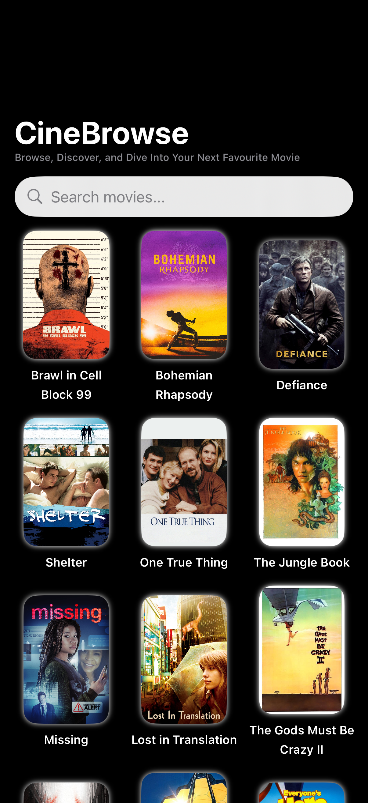
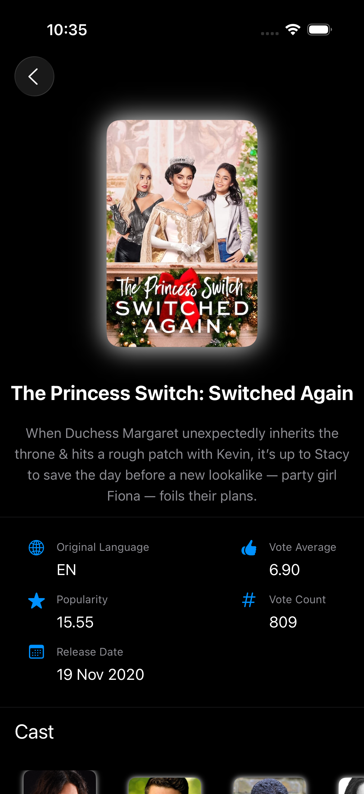

# 🎬 CineBrowse

CineBrowse is a beautifully crafted SwiftUI movie browsing app that allows users to explore, search, and view details of movies with a smooth and modern UI experience.

---

## ✨ Features

- **🏠 Home Page**  
  Displays a scrollable grid of movie posters along with their names. Tapping on any movie navigates to a detailed view.

- **🔍 Searchable Home View**  
  Integrated with SwiftUI’s latest `.searchable` modifier to filter movies in real-time.

- **💧 Glassmorphism UI**  
  Modern liquid glass effect used on elements like the search bar and back button, enhancing visual appeal.

- **🚀 Launch Screen Animation**  
  Custom animated launch screen gives the app a polished and professional startup experience.

- **🎥 Detailed Movie View**  
  - Movie Poster  
  - Overview  
  - Original Language  
  - Popularity  
  - Release Date  
  - Cast List with:
    - Cast Image
    - Actor Name
    - Character Name

- **🖼️ Image Loading & Caching**  
  Uses [Kingfisher](https://github.com/onevcat/Kingfisher) for efficient image downloading and caching.

- **🧠 Architecture**  
  Built using MVVM architecture with a clean separation of concerns for scalability and testability.

---

## 🛠️ Tech Stack

- **Swift**
- **SwiftUI**
- **Combine**
- **MVVM Architecture**
- **Kingfisher**

---

## 📸 Screenshots

<table>
  <tr>
      <td align="center">
      <strong>Home Page</strong> 
      
    </td>
    <td align="center">
      <strong>Search Page UI</strong> 
      
    </td>
    <td align="center">
      <strong>Detail Page</strong> 
      
    </td>
  </tr>
</table>

---

## 🚧 Future Improvements

- Add pagination for movie lists  
- Offline caching support  
- Favorites / Watchlist feature  
- Improved animations and transitions

